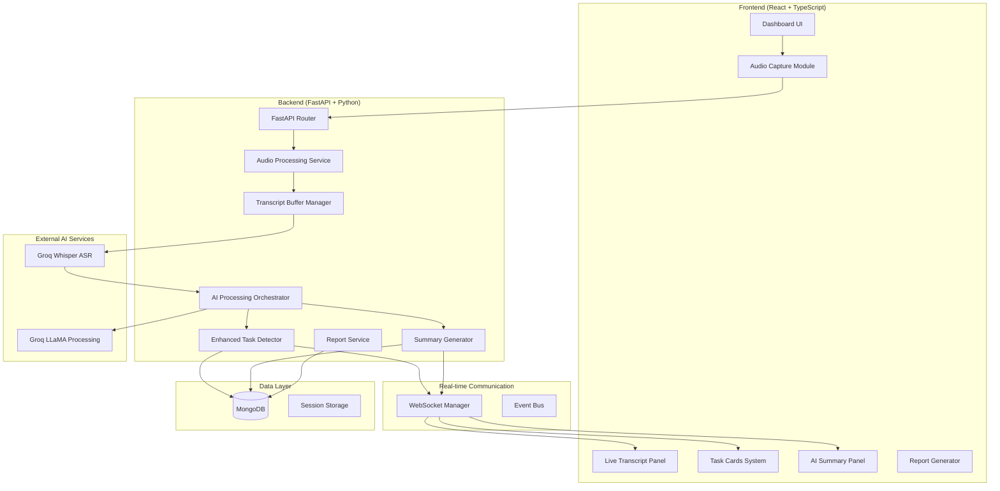
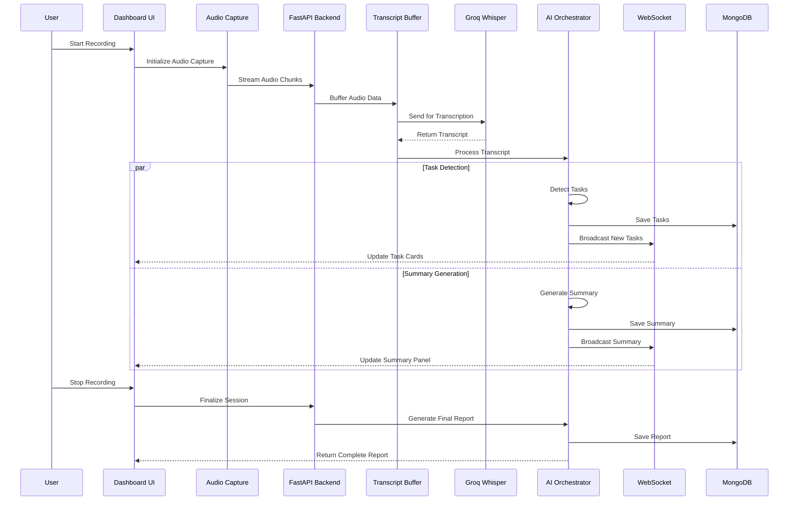

# Design Document: MeetNova Production Upgrade

## Overview

MeetNova is being upgraded from a sophisticated prototype to a production-ready AI-powered Google Meet assistant. The system already has core capabilities including real-time transcription via Groq Whisper, AI-powered task detection, WebSocket-based real-time updates, and a React frontend. This upgrade focuses on enhancing the existing architecture for production reliability, scalability, and comprehensive meeting intelligence features.

The upgrade maintains the existing tech stack (FastAPI + React + Groq APIs) while adding robust audio capture, enhanced AI processing pipelines, comprehensive error handling, and production-grade performance optimizations. The system will capture live audio from Google Meet, process it through multiple AI stages, and generate actionable meeting intelligence including summaries, task allocations, key decisions, and action items.

## Architecture



## Main Algorithm/Workflow



## Core Interfaces/Types

```typescript
// Audio Processing Interfaces
interface AudioCaptureConfig {
  sampleRate: number;
  channels: number;
  chunkSize: number;
  format: 'webm' | 'wav' | 'mp3';
}

interface AudioChunk {
  id: string;
  data: Blob;
  timestamp: number;
  duration: number;
  speakerTag?: string;
}

// Transcription Interfaces
interface TranscriptSegment {
  id: string;
  text: string;
  speaker: string;
  timestamp: number;
  confidence: number;
  startTime: number;
  endTime: number;
}

interface TranscriptBuffer {
  segments: TranscriptSegment[];
  totalDuration: number;
  speakerCount: number;
  lastProcessedTime: number;
}

// AI Processing Interfaces
interface AIProcessingResult {
  tasks: DetectedTask[];
  summary: MeetingSummary;
  keyPoints: KeyPoint[];
  decisions: Decision[];
  actionItems: ActionItem[];
}

interface DetectedTask {
  id: string;
  title: string;
  assignee?: string;
  deadline?: string;
  priority: 'low' | 'medium' | 'high';
  status: 'pending' | 'in-progress' | 'done';
  confidence: number;
  sourceText: string;
  timestamp: number;
}

interface MeetingSummary {
  id: string;
  content: string;
  keyTopics: string[];
  participants: string[];
  duration: number;
  generatedAt: number;
}

// Real-time Communication
interface WebSocketMessage {
  type: 'transcript' | 'task' | 'summary' | 'error';
  payload: any;
  timestamp: number;
  sessionId: string;
}

// Session Management
interface MeetingSession {
  id: string;
  startTime: number;
  endTime?: number;
  participants: string[];
  transcripts: TranscriptSegment[];
  tasks: DetectedTask[];
  summary?: MeetingSummary;
  status: 'active' | 'completed' | 'error';
}
```

## Key Functions with Formal Specifications

### Function 1: captureAudioStream()

```typescript
async function captureAudioStream(config: AudioCaptureConfig): Promise<MediaStream>
```

**Preconditions:**
- Browser supports MediaDevices API
- User has granted microphone permissions
- System audio capture is available (for Google Meet tab)
- `config` contains valid audio parameters

**Postconditions:**
- Returns combined MediaStream with both microphone and system audio
- Stream contains exactly 2 audio tracks (mic + system)
- Audio quality matches specified configuration
- No echo or feedback loops present

**Loop Invariants:** N/A (no loops in this function)

### Function 2: processTranscriptChunk()

```typescript
async function processTranscriptChunk(
  chunk: AudioChunk, 
  buffer: TranscriptBuffer
): Promise<TranscriptSegment[]>
```

**Preconditions:**
- `chunk.data` is valid audio blob
- `buffer` is initialized and consistent
- Groq Whisper API is accessible
- Audio format is supported by ASR service

**Postconditions:**
- Returns array of transcript segments with confidence > 0.7
- Buffer is updated with new segments
- Duplicate segments are filtered out
- Speaker identification is attempted when possible

**Loop Invariants:**
- For processing loops: All processed segments maintain chronological order
- Buffer size never exceeds maximum threshold

### Function 3: detectTasksFromTranscript()

```typescript
async function detectTasksFromTranscript(
  segments: TranscriptSegment[]
): Promise<DetectedTask[]>
```

**Preconditions:**
- `segments` array is non-empty and chronologically ordered
- Each segment has valid text content
- AI processing service is available
- User context is established

**Postconditions:**
- Returns tasks with confidence scores ≥ 0.6
- Each task has valid title and priority
- Assignee extraction attempted for all tasks
- Deadline parsing applied where applicable

**Loop Invariants:**
- For segment processing: All previously processed segments remain valid
- Task confidence scores remain within [0.0, 1.0] range

### Function 4: generateMeetingSummary()

```typescript
async function generateMeetingSummary(
  session: MeetingSession
): Promise<MeetingSummary>
```

**Preconditions:**
- `session` contains at least 30 seconds of transcript data
- Session is in 'completed' or 'active' state
- AI summarization service is available
- Transcript quality is sufficient for processing

**Postconditions:**
- Returns structured summary with exactly 5 key points
- Summary length is between 200-500 words
- Key topics are extracted and categorized
- Participant insights are included when identifiable

**Loop Invariants:** N/A (uses AI service, no explicit loops)

## Algorithmic Pseudocode

### Main Processing Algorithm

```pascal
ALGORITHM processLiveMeeting(audioStream)
INPUT: audioStream of type MediaStream
OUTPUT: meetingSession of type MeetingSession

BEGIN
  ASSERT audioStream.getTracks().length >= 1
  
  // Step 1: Initialize session
  session ← createMeetingSession()
  buffer ← initializeTranscriptBuffer()
  
  // Step 2: Process audio chunks with loop invariant
  WHILE audioStream.active DO
    ASSERT buffer.isConsistent() AND session.isValid()
    
    chunk ← captureAudioChunk(audioStream, CHUNK_SIZE)
    segments ← processTranscriptChunk(chunk, buffer)
    
    IF segments.length > 0 THEN
      // Real-time task detection
      tasks ← detectTasksFromTranscript(segments)
      broadcastTasks(tasks, session.id)
      
      // Update session
      session.transcripts.addAll(segments)
      session.tasks.addAll(tasks)
    END IF
    
    // Periodic summary updates
    IF buffer.duration MOD SUMMARY_INTERVAL = 0 THEN
      partialSummary ← generatePartialSummary(session)
      broadcastSummary(partialSummary, session.id)
    END IF
  END WHILE
  
  // Step 3: Finalize session
  finalSummary ← generateMeetingSummary(session)
  session.summary ← finalSummary
  session.status ← 'completed'
  
  ASSERT session.isComplete() AND session.summary.isValid()
  
  RETURN session
END
```

**Preconditions:**
- audioStream is active and contains valid audio tracks
- System has sufficient resources for real-time processing
- All AI services are accessible and authenticated

**Postconditions:**
- session contains complete meeting data
- All transcripts are processed and stored
- Tasks are detected and categorized
- Final summary is generated and validated

**Loop Invariants:**
- buffer maintains chronological order of segments
- session.transcripts length is non-decreasing
- All stored tasks have valid confidence scores

### Audio Capture Algorithm

```pascal
ALGORITHM captureSystemAndMicAudio()
INPUT: none
OUTPUT: combinedStream of type MediaStream

BEGIN
  // Step 1: Capture system audio (Google Meet tab)
  displayStream ← getDisplayMedia({
    audio: true,
    video: false,
    systemAudio: "include"
  })
  
  // Step 2: Capture microphone audio
  micStream ← getUserMedia({
    audio: {
      echoCancellation: true,
      noiseSuppression: true,
      autoGainControl: true,
      sampleRate: 44100
    }
  })
  
  // Step 3: Create audio context for mixing
  audioContext ← new AudioContext()
  destination ← audioContext.createMediaStreamDestination()
  
  // Step 4: Mix audio streams
  IF displayStream.getAudioTracks().length > 0 THEN
    systemSource ← audioContext.createMediaStreamSource(displayStream)
    systemGain ← audioContext.createGain()
    systemGain.gain.value ← 1.2  // Boost system audio
    systemSource.connect(systemGain)
    systemGain.connect(destination)
  END IF
  
  IF micStream.getAudioTracks().length > 0 THEN
    micSource ← audioContext.createMediaStreamSource(micStream)
    micGain ← audioContext.createGain()
    micGain.gain.value ← 1.0
    micSource.connect(micGain)
    micGain.connect(destination)
  END IF
  
  ASSERT destination.stream.getAudioTracks().length > 0
  
  RETURN destination.stream
END
```

**Preconditions:**
- Browser supports getDisplayMedia and getUserMedia APIs
- User grants necessary permissions
- Audio hardware is available and functional

**Postconditions:**
- Returns MediaStream with combined audio
- No audio feedback or echo present
- Stream quality meets specified requirements

**Loop Invariants:** N/A (no loops in this algorithm)

### Task Detection Algorithm

```pascal
ALGORITHM detectTasksWithAI(transcriptText)
INPUT: transcriptText of type string
OUTPUT: tasks of type DetectedTask[]

BEGIN
  ASSERT transcriptText.length >= 10
  
  // Step 1: Preprocess text
  cleanText ← removeNoiseWords(transcriptText)
  sentences ← splitIntoSentences(cleanText)
  
  // Step 2: AI-powered detection
  prompt ← buildTaskDetectionPrompt(cleanText)
  aiResponse ← callGroqLLM(prompt, {
    model: "llama-3.1-8b-instant",
    temperature: 0.1,
    maxTokens: 800
  })
  
  // Step 3: Parse and validate AI response
  rawTasks ← parseJSONResponse(aiResponse)
  validatedTasks ← []
  
  FOR each taskData IN rawTasks DO
    IF isValidTaskStructure(taskData) THEN
      task ← createDetectedTask(taskData)
      task.assignee ← normalizeAssignee(task.assignee)
      task.deadline ← parseDeadline(task.deadline)
      task.confidence ← min(task.confidence, 1.0)
      
      IF task.confidence >= CONFIDENCE_THRESHOLD THEN
        validatedTasks.add(task)
      END IF
    END IF
  END FOR
  
  // Step 4: Deduplicate tasks
  uniqueTasks ← removeDuplicateTasks(validatedTasks)
  
  ASSERT all tasks in uniqueTasks have confidence >= CONFIDENCE_THRESHOLD
  
  RETURN uniqueTasks
END
```

**Preconditions:**
- transcriptText contains meaningful content
- AI service is available and authenticated
- Task detection patterns are configured

**Postconditions:**
- All returned tasks have confidence ≥ threshold
- Tasks are deduplicated and validated
- Assignee and deadline fields are normalized

**Loop Invariants:**
- For validation loop: All processed tasks maintain valid structure
- Confidence scores remain within valid range [0.0, 1.0]

## Example Usage

```typescript
// Example 1: Initialize Meeting Session
const audioConfig: AudioCaptureConfig = {
  sampleRate: 44100,
  channels: 2,
  chunkSize: 4096,
  format: 'webm'
};

const meetingSession = await initializeMeetingSession({
  participantName: "John Doe",
  meetingTitle: "Product Planning Meeting",
  audioConfig
});

// Example 2: Process Real-time Audio
const audioStream = await captureSystemAndMicAudio();
const processor = new AudioProcessor(audioConfig);

processor.on('transcript', (segment: TranscriptSegment) => {
  console.log(`${segment.speaker}: ${segment.text}`);
  updateLiveTranscript(segment);
});

processor.on('task', (task: DetectedTask) => {
  console.log(`New task detected: ${task.title}`);
  addTaskCard(task);
});

await processor.start(audioStream);

// Example 3: Generate Meeting Report
const report = await generateMeetingReport(meetingSession.id);
console.log('Meeting Summary:', report.summary);
console.log('Action Items:', report.actionItems);
console.log('Key Decisions:', report.decisions);

// Example 4: WebSocket Real-time Updates
const ws = new WebSocket('/api/detected-tasks/ws');

ws.onmessage = (event) => {
  const message: WebSocketMessage = JSON.parse(event.data);
  
  switch (message.type) {
    case 'transcript':
      updateTranscriptPanel(message.payload);
      break;
    case 'task':
      addTaskToUI(message.payload);
      break;
    case 'summary':
      updateSummaryPanel(message.payload);
      break;
  }
};

// Example 5: Error Handling and Recovery
try {
  await processor.start(audioStream);
} catch (error) {
  if (error instanceof AudioCaptureError) {
    showPermissionDialog();
  } else if (error instanceof TranscriptionError) {
    fallbackToManualEntry();
  } else {
    logErrorAndRestart(error);
  }
}
```

## Correctness Properties

### Property 1: Audio Capture Completeness
*For any* active Google Meet session, the audio capture system SHALL capture both microphone input and system audio without loss, ensuring no gaps in the audio stream exceed 100ms.

### Property 2: Transcription Accuracy Preservation
*For any* audio chunk processed through the transcription pipeline, the output transcript SHALL maintain chronological order and filter out segments with confidence below 0.7.

### Property 3: Task Detection Consistency
*For any* transcript text containing task-indicating patterns, the AI task detector SHALL generate tasks with confidence scores in the range [0.0, 1.0] and SHALL NOT produce duplicate tasks within the same session.

### Property 4: Real-time Update Delivery
*For any* WebSocket-connected client, task detection events SHALL be delivered within 2 seconds of detection, and connection failures SHALL trigger automatic reconnection with exponential backoff.

### Property 5: Session Data Integrity
*For any* meeting session, the stored data SHALL maintain referential integrity between transcripts, tasks, and summaries, and session state transitions SHALL follow the defined state machine.

### Property 6: Summary Generation Completeness
*For any* completed meeting session with at least 30 seconds of transcript data, the summary generator SHALL produce exactly 5 key points and identify all mentioned participants.

### Property 7: Error Recovery Robustness
*For any* service failure (ASR, AI, or database), the system SHALL gracefully degrade functionality while maintaining data consistency and SHALL recover automatically when services become available.

### Property 8: Performance Scalability
*For any* meeting session up to 2 hours duration, the system SHALL process audio chunks within 500ms and maintain memory usage below 512MB per session.

## Error Handling

### Audio Capture Errors

| Error Scenario | Detection Method | Recovery Strategy |
|---|---|---|
| Microphone permission denied | `NotAllowedError` from getUserMedia | Show permission dialog with instructions |
| System audio unavailable | Empty audio tracks in display stream | Fall back to microphone-only mode |
| Audio device disconnected | Stream `ended` event | Prompt user to reconnect device |
| Browser compatibility | Feature detection | Show unsupported browser message |

### Transcription Errors

| Error Scenario | Detection Method | Recovery Strategy |
|---|---|---|
| Groq API rate limit | HTTP 429 response | Implement exponential backoff retry |
| Network timeout | Request timeout | Queue chunks for retry |
| Invalid audio format | API error response | Convert audio format client-side |
| Empty transcription | Empty response text | Skip chunk and continue |

### AI Processing Errors

| Error Scenario | Detection Method | Recovery Strategy |
|---|---|---|
| LLM API failure | HTTP error or timeout | Use rule-based fallback detection |
| Invalid JSON response | JSON parse error | Retry with simplified prompt |
| Task confidence too low | Confidence < threshold | Discard task but log for analysis |
| Summary generation failure | API error | Generate basic summary from keywords |

### WebSocket Communication Errors

| Error Scenario | Detection Method | Recovery Strategy |
|---|---|---|
| Connection lost | WebSocket close event | Automatic reconnection with backoff |
| Message delivery failure | Send error | Queue messages for retry |
| Authentication failure | Auth error message | Redirect to login |
| Payload too large | Message size limit | Split large payloads |

## Testing Strategy

### Unit Testing Approach

**Backend Testing (Python + pytest + hypothesis)**
- Audio processing service unit tests
- Transcript buffer management tests
- Task detection algorithm tests
- WebSocket message handling tests
- Database operation tests

**Frontend Testing (TypeScript + Vitest + fast-check)**
- Audio capture component tests
- Real-time UI update tests
- WebSocket client tests
- Task card rendering tests
- Summary panel tests

### Property-Based Testing Approach

**Property Test Library**: Hypothesis (Python) and fast-check (TypeScript)

**Key Properties to Test**:
1. Audio chunk processing maintains chronological order
2. Task detection produces valid confidence scores
3. WebSocket messages are delivered in order
4. Session state transitions are valid
5. Summary generation produces consistent output

### Integration Testing Approach

**End-to-End Testing**:
- Complete meeting session simulation
- Multi-user WebSocket communication
- Audio capture to final report generation
- Error recovery scenarios
- Performance under load

**API Testing**:
- All REST endpoints with various payloads
- WebSocket connection lifecycle
- Authentication and authorization
- Rate limiting and error responses

## Performance Considerations

### Real-time Processing Requirements

- **Audio Processing Latency**: < 500ms per chunk
- **Transcription Latency**: < 2 seconds per segment
- **Task Detection Latency**: < 3 seconds per detection
- **WebSocket Message Delivery**: < 100ms
- **UI Update Responsiveness**: < 50ms

### Memory Management

- **Audio Buffer Size**: Maximum 10MB per session
- **Transcript Buffer**: Maximum 1000 segments
- **Task Cache**: Maximum 500 tasks per session
- **WebSocket Connections**: Maximum 100 concurrent

### Scalability Optimizations

- **Audio Chunk Batching**: Process multiple chunks together
- **Transcript Deduplication**: Remove repeated segments
- **Task Confidence Filtering**: Only process high-confidence tasks
- **Database Connection Pooling**: Reuse database connections
- **CDN for Static Assets**: Serve frontend from CDN

### Caching Strategy

- **Transcript Segments**: Cache in Redis for 24 hours
- **AI Model Responses**: Cache common patterns
- **User Sessions**: Cache active session data
- **Task Templates**: Cache frequently used task patterns

## Security Considerations

### Audio Data Protection

- **Encryption in Transit**: All audio data encrypted via HTTPS/WSS
- **Temporary Storage**: Audio chunks deleted after processing
- **Access Control**: User-specific session isolation
- **Audit Logging**: Log all audio processing events

### API Security

- **Authentication**: JWT tokens for all API access
- **Rate Limiting**: Prevent API abuse and DoS attacks
- **Input Validation**: Sanitize all user inputs
- **CORS Configuration**: Restrict cross-origin requests

### Data Privacy

- **Transcript Retention**: Configurable retention periods
- **User Consent**: Explicit consent for audio recording
- **Data Anonymization**: Remove PII from stored transcripts
- **GDPR Compliance**: Support data deletion requests

### Infrastructure Security

- **Environment Variables**: Secure API key storage
- **Database Security**: Encrypted connections and access controls
- **Network Security**: VPC and firewall configurations
- **Monitoring**: Real-time security event monitoring

## Dependencies

### Backend Dependencies (Python)

```python
# Core Framework
fastapi==0.115.12
uvicorn==0.34.0

# Database
motor==3.6.0
beanie==1.27.0

# AI Services
groq==0.13.0
httpx==0.28.1

# Audio Processing
pydub==0.25.1
librosa==0.10.1
soundfile==0.12.1

# Real-time Communication
websockets==12.0
redis==5.0.1

# Utilities
python-dotenv==1.1.0
pydantic[email]==2.12.5
python-multipart==0.0.20

# Testing
pytest==8.3.5
pytest-asyncio==0.26.0
hypothesis==6.131.15
```

### Frontend Dependencies (TypeScript/React)

```json
{
  "dependencies": {
    "react": "^18.2.0",
    "react-dom": "^18.2.0",
    "typescript": "^5.0.0",
    "vite": "^5.0.0",
    "tailwindcss": "^3.4.0",
    "framer-motion": "^11.0.0",
    "lucide-react": "^0.400.0",
    "@tanstack/react-query": "^5.0.0",
    "zustand": "^4.5.0"
  },
  "devDependencies": {
    "vitest": "^1.6.0",
    "@testing-library/react": "^15.0.0",
    "@testing-library/jest-dom": "^6.4.0",
    "fast-check": "^3.19.0",
    "@types/react": "^18.2.0",
    "@types/node": "^20.0.0"
  }
}
```

### External Services

- **Groq Whisper API**: Real-time speech-to-text transcription
- **Groq LLaMA API**: AI-powered task detection and summarization
- **MongoDB Atlas**: Cloud database for production deployment
- **Redis Cloud**: Caching and session management
- **Vercel/Netlify**: Frontend deployment and CDN
- **Railway/Render**: Backend API deployment

### Browser APIs Required

- **MediaDevices API**: Audio capture from microphone and system
- **WebRTC API**: Real-time audio processing
- **WebSocket API**: Real-time communication
- **Clipboard API**: Copy functionality
- **Notification API**: Meeting alerts and updates
- **IndexedDB API**: Client-side data caching