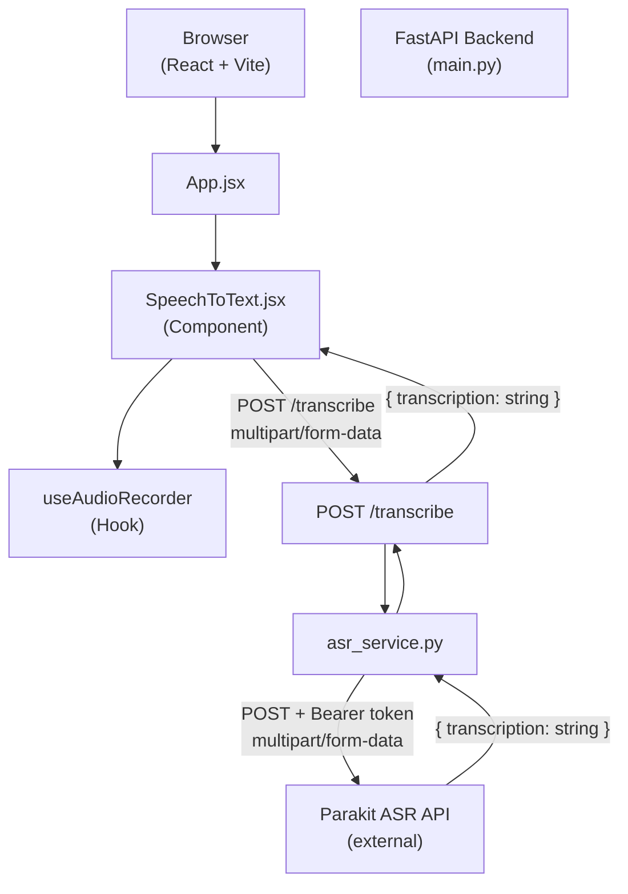

# Design Document: Speech-to-Text ASR

## Overview

This feature adds real-time Speech-to-Text (STT) capability to the existing full-stack application. Users record audio in the browser via the MediaRecorder API; the audio blob is sent to a new `POST /transcribe` FastAPI endpoint, which delegates transcription to the Parakit ASR API through a dedicated service module. The transcribed text is displayed in a new `SpeechToText` React component that sits alongside the existing text summarizer, with an option to pipe the transcription directly into the summarizer input.

**Key design decisions:**

- **`httpx` over `requests` for the ASR service** — the endpoint is `async`, so the HTTP call to Parakit must also be async. `httpx.AsyncClient` is the idiomatic choice for async FastAPI services.
- **MIME-type validation at the endpoint layer** — format checking happens before the audio bytes reach the service, keeping the service focused on API communication.
- **Custom React hook (`useAudioRecorder`)** — recording logic is extracted from the component into a hook for testability and reuse.
- **Scroll-position tracking via `useRef`** — auto-scroll is implemented without re-renders by tracking a `userScrolled` flag on a ref.

---

## Architecture



**Data flow:**

1. User clicks "Start Recording" → `useAudioRecorder` calls `getUserMedia` and starts `MediaRecorder`.
2. User clicks "Stop Recording" → `MediaRecorder` fires `ondataavailable`, chunks are assembled into an `Audio_Blob`.
3. `SpeechToText.jsx` POSTs the blob as `multipart/form-data` to `POST /transcribe`.
4. FastAPI validates the MIME type, reads the bytes, and calls `asr_service.transcribe(bytes, mime_type)`.
5. `asr_service` POSTs to the Parakit API with `Authorization: Bearer <PARAKIT_API_KEY>`.
6. The transcription string is returned up the chain and rendered in the output area.

---

## Components and Interfaces

### Backend

#### `POST /transcribe` endpoint (`backend/main.py`)

```python
@app.post("/transcribe")
async def transcribe(audio: UploadFile = File(...)) -> dict:
    ...
```

- Accepts `multipart/form-data` with a field named `audio`.
- Validates `audio.content_type` against `{"audio/wav", "audio/mpeg"}`. Returns HTTP 415 on mismatch.
- Reads bytes with `await audio.read()`.
- Calls `await asr_service.transcribe(audio_bytes, audio.content_type)`.
- Returns `{"transcription": <string>}` on success.
- FastAPI's built-in validation returns HTTP 422 when the `audio` field is absent.

#### `asr_service.py` (`backend/services/asr_service.py`)

```python
async def transcribe(audio_bytes: bytes, mime_type: str) -> str:
    ...
```

- Loaded at module level: `load_dotenv()` then `PARAKIT_API_KEY = os.getenv("PARAKIT_API_KEY")`.
- Raises `ValueError` at module load if `PARAKIT_API_KEY` is absent or empty.
- Uses `httpx.AsyncClient` to POST to the Parakit API endpoint.
- Attaches `Authorization: Bearer {PARAKIT_API_KEY}` header on every request.
- On HTTP error response: raises `RuntimeError(f"Parakit API error {status_code}: {body}")`.
- On network/timeout error: raises `RuntimeError("ASR service unreachable: {detail}")`.
- On success: extracts and returns `response.json()["transcription"]`.

### Frontend

#### `useAudioRecorder` hook (`frontend/src/hooks/useAudioRecorder.js`)

```js
const {
  isRecording,
  startRecording,
  stopRecording,
  audioBlob,
  error,
} = useAudioRecorder();
```

- Manages `MediaRecorder` lifecycle: `getUserMedia`, `start`, `stop`, chunk collection.
- Sets `error` to a descriptive string when `MediaRecorder` is unsupported or permission is denied.
- Resolves `audioBlob` (a `Blob` of type `audio/webm` or `audio/wav` depending on browser support) when recording stops.

#### `SpeechToText.jsx` (`frontend/src/components/SpeechToText.jsx`)

Props:
```js
{
  onTranscription: (text: string) => void  // callback to parent for "Use in Summarizer"
}
```

Internal state:
| State | Type | Description |
|---|---|---|
| `transcription` | `string` | Latest transcription text |
| `isLoading` | `boolean` | True while POST /transcribe is in-flight |
| `error` | `string \| null` | Error message to display |
| `copyStatus` | `'idle' \| 'copied' \| 'error'` | Clipboard feedback state |

Refs:
| Ref | Description |
|---|---|
| `outputRef` | Points to the transcription output `<div>` for scroll control |
| `userScrolledRef` | Boolean flag — true when user has manually scrolled up |

#### `App.jsx` (updated)

- Lifts `summarizerText` state to `App`.
- Renders `<SpeechToText onTranscription={(t) => setSummarizerText(t)} />` and the existing summarizer side by side.
- Summarizer and STT states are independent; `onTranscription` only sets the summarizer input, it does not affect STT state.

---

## Data Models

### HTTP Request: `POST /transcribe`

```
Content-Type: multipart/form-data
Body field: audio  (binary, audio/wav or audio/mpeg)
```

### HTTP Response: `POST /transcribe` (success)

```json
{
  "transcription": "Hello, this is the transcribed text."
}
```

### HTTP Response: `POST /transcribe` (error)

```json
{
  "detail": "Unsupported audio format. Only WAV and MP3 are accepted."
}
```

### Parakit API Request (internal, from `asr_service.py`)

```
POST <PARAKIT_API_ENDPOINT>
Authorization: Bearer <PARAKIT_API_KEY>
Content-Type: multipart/form-data
Body field: audio  (binary audio bytes)
Body field: mime_type  (string, e.g. "audio/wav")
```

### Parakit API Response (assumed shape, based on requirements)

```json
{
  "transcription": "Hello, this is the transcribed text."
}
```

### Environment Variables (`backend/.env`)

```
PARAKIT_API_KEY=<your-key-here>
PARAKIT_API_ENDPOINT=<parakit-asr-endpoint-url>
```

---

## Correctness Properties

*A property is a characteristic or behavior that should hold true across all valid executions of a system — essentially, a formal statement about what the system should do. Properties serve as the bridge between human-readable specifications and machine-verifiable correctness guarantees.*

### Property 1: Transcription round-trip

*For any* valid audio bytes and supported MIME type (`audio/wav` or `audio/mpeg`), when the ASR service mock returns a transcription string T, the `POST /transcribe` endpoint response JSON shall contain a `transcription` field equal to T.

**Validates: Requirements 1.1, 1.2**

---

### Property 2: Invalid MIME type rejection

*For any* MIME type string that is not `audio/wav` or `audio/mpeg`, the `POST /transcribe` endpoint shall return HTTP 415.

**Validates: Requirements 1.4**

---

### Property 3: ASR service extracts transcription from API response

*For any* transcription string T present in the Parakit API mock response payload, `asr_service.transcribe()` shall return exactly T.

**Validates: Requirements 2.1, 2.2**

---

### Property 4: HTTP error propagation with status code

*For any* HTTP error status code in the range 400–599 returned by the Parakit API mock, `asr_service.transcribe()` shall raise a `RuntimeError` whose message contains that status code.

**Validates: Requirements 2.3**

---

### Property 5: Authorization header on every request

*For any* audio bytes and MIME type passed to `asr_service.transcribe()`, the outgoing HTTP request to the Parakit API shall always include an `Authorization: Bearer <PARAKIT_API_KEY>` header.

**Validates: Requirements 2.6**

---

### Property 6: Recording state drives button label and indicator

*For any* recording state value (recording or idle), the toggle button label shall be `"Stop Recording"` when recording is active and `"Start Recording"` when idle, and the recording indicator element shall be present in the DOM if and only if recording is active.

**Validates: Requirements 4.1, 5.1, 5.2, 5.3**

---

### Property 7: Transcription text displayed in output area

*For any* transcription string T returned by the `POST /transcribe` mock, the `SpeechToText` component's output area shall contain T as its text content.

**Validates: Requirements 4.5**

---

### Property 8: Independent component state

*For any* sequence of actions performed on the summarizer (typing, submitting), the `SpeechToText` component's internal state (transcription, isRecording, isLoading) shall remain unchanged; and for any sequence of recording/transcription actions, the summarizer input state shall remain unchanged unless the user explicitly clicks "Use in Summarizer".

**Validates: Requirements 6.3**

---

### Property 9: Copy writes correct text to clipboard

*For any* transcription string T displayed in the output area, clicking the Copy button shall call `navigator.clipboard.writeText` with exactly T as its argument.

**Validates: Requirements 7.2**

---

### Property 10: Auto-scroll behavior based on scroll position

*For any* new transcription text set on the component: if `userScrolledRef` is `false` (user is at the bottom), the output container's `scrollTop` shall be set to `scrollHeight`; if `userScrolledRef` is `true` (user has scrolled up), `scrollTop` shall not be modified.

**Validates: Requirements 8.1, 8.2**

---

## Error Handling

| Scenario | Layer | Behavior |
|---|---|---|
| Missing `audio` field in request | FastAPI validation | HTTP 422 with field error detail |
| Unsupported audio MIME type | `/transcribe` endpoint | HTTP 415 with descriptive message |
| `PARAKIT_API_KEY` missing at startup | `asr_service` module load | `ValueError` — server fails to start |
| Parakit API returns 4xx/5xx | `asr_service` | `RuntimeError` with status code + body; endpoint returns HTTP 502 |
| Network timeout / connection refused | `asr_service` | `RuntimeError` with connectivity message; endpoint returns HTTP 503 |
| `MediaRecorder` not supported | `useAudioRecorder` | Sets `error` → component displays "Your browser does not support audio recording." |
| Microphone permission denied | `useAudioRecorder` | Catches `NotAllowedError` → sets `error` → component displays "Please grant microphone access." |
| Clipboard write fails | `SpeechToText.jsx` | Sets `copyStatus = 'error'` → displays "Copy failed" message |

**Backend error mapping** — the `/transcribe` endpoint catches `RuntimeError` from the service and maps it to appropriate HTTP status codes:

```python
except RuntimeError as e:
    if "unreachable" in str(e):
        raise HTTPException(status_code=503, detail=str(e))
    raise HTTPException(status_code=502, detail=str(e))
```

---

## Testing Strategy

### Backend (Python — `pytest` + `pytest-asyncio` + `hypothesis`)

**Unit tests** (`tests/test_transcribe_endpoint.py`, `tests/test_asr_service.py`):
- Missing `audio` field → HTTP 422 (example)
- Unsupported MIME type → HTTP 415 (example)
- Network timeout → `RuntimeError` with descriptive message (example)
- Missing `PARAKIT_API_KEY` → `ValueError` at import (example)
- Microphone permission denied message (example)

**Property-based tests** (using `hypothesis`):
- Property 1: `@given(audio_bytes=st.binary(min_size=1), transcription=st.text())` — mock ASR service, verify round-trip
- Property 2: `@given(mime_type=st.text().filter(lambda m: m not in {"audio/wav", "audio/mpeg"}))` — verify 415
- Property 3: `@given(transcription=st.text())` — mock httpx, verify service returns exact text
- Property 4: `@given(status_code=st.integers(min_value=400, max_value=599))` — mock httpx error, verify RuntimeError contains code
- Property 5: `@given(audio_bytes=st.binary(min_size=1), mime_type=st.sampled_from(["audio/wav", "audio/mpeg"]))` — capture outgoing request, verify Authorization header

Each property test runs a minimum of 100 iterations (Hypothesis default).

Tag format: `# Feature: speech-to-text-asr, Property {N}: {property_text}`

### Frontend (JavaScript — `vitest` + `@testing-library/react` + `fast-check`)

**Unit tests** (`src/components/__tests__/SpeechToText.test.jsx`):
- Renders "Start Recording" button initially (example)
- Shows loading indicator and disabled button while loading (example)
- Displays error on API failure (example)
- Shows unsupported browser message when `MediaRecorder` is undefined (example)
- Shows permission denied message on `NotAllowedError` (example)
- Copy button appears when transcription is present (example)
- Confirmation message appears then reverts after 2 seconds on successful copy (example)
- Copy error message shown on clipboard failure (example)
- Both components rendered in App (example)
- "Use in Summarizer" transfers text to summarizer input (example)

**Property-based tests** (using `fast-check`):
- Property 6: `fc.property(fc.boolean(), ...)` — verify button label and indicator for any recording state
- Property 7: `fc.property(fc.string({ minLength: 1 }), ...)` — mock fetch, verify transcription text in output
- Property 8: `fc.property(fc.array(fc.oneof(...)), ...)` — interleaved actions, verify state independence
- Property 9: `fc.property(fc.string({ minLength: 1 }), ...)` — verify clipboard.writeText called with exact text
- Property 10: `fc.property(fc.boolean(), fc.string({ minLength: 1 }), ...)` — verify scroll behavior based on userScrolled flag

Each property test runs a minimum of 100 iterations (`fc.assert(fc.property(...), { numRuns: 100 })`).

Tag format: `// Feature: speech-to-text-asr, Property {N}: {property_text}`

### Integration

- Start backend with a real `PARAKIT_API_KEY` (or a staging key) and POST a short WAV file to `/transcribe`; verify a non-empty transcription string is returned (1–2 examples).
- Verify `requirements.txt` installs cleanly in a fresh virtual environment.
